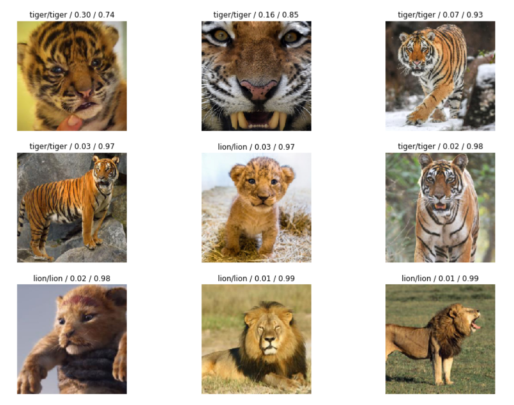

# lion_tiger
Lion or tiger? 100% recognition after training on 80 images.

This is a short exploration of how easy one can train an accurate image classifier using transfer learning and less than one hundred images downloaded from the internet.

The notebook is based on lessons 1 and 2 of the third version of the [fastai](https://www.fast.ai) course, which was made available in January 2019.
